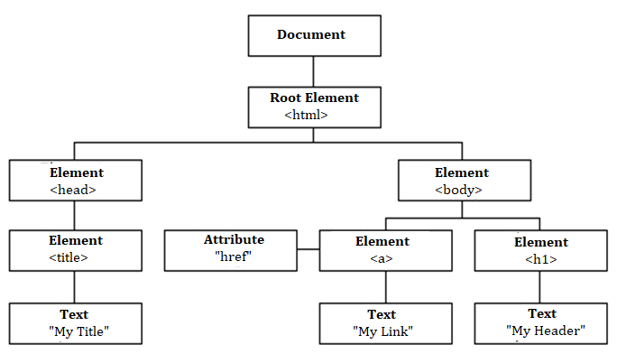

### Adding Javascript to Html document
1. In ```<head>``` tag : ```<script type="text/javascript"></script>```
2. In ```<body>``` tag : ```<script type="text/javascript"></script>```
3. External file : ```<script type="text/javascript" src="./first.js"></script>```
   
> **NOTE:** Order of Placing Script tags is important.Browser rends elements in a Sequencial Order  

### Output Statements
1. alert()  
   ```window.alert("Hello World");```
2. document.write  
   ```document.write("Hello World")```
3. innerHtml  
   ```document.getElementById("greet").innerHTML = "Hello World";```
4. console.log()  
   ```console.log("Hello World")```

### RoadMap to JavaScript  

#### Basic  

* What is Javascript and its features
* Variable
* Datatypes
* Operators
* Conditional Statements
* Looping Statements
* Data Structures
* Scope
* Objects
* Functions
* Form Validations
* DOM Manipulation
* Events
* BOM Elements

#### Advanced
* Prototyping
* Prototype Inheritance
* Callbacks
* Immediately Invoked Function Execution (IIFE)
* Promises
* Ajax
* Async Await
* Closures
* OOPs Concepts
* JSON

### Variable

1. What is Variable?
   > A Variable is a memory container used to store values/data.  

2. How to declare Variable?
   > In old version of js we can declare variable only using ```var``` keyword

   In 2006, new version of Javascript was released i.e EcmaScript(ES6).  
   It comes with more additional features over than js. 

   In ES6 , we can declare variable using 3 keywords.They are ```var```,```let``` and ```const```  
   Example :  
   ```
   var name = "Gangadhar"  
   let country = "India"
   const ZIPCODE = 531031
   ```

### VAR vs LET vs CONST  

#### VAR
* Declare - More than once
* Assign - More than once
* Hoisting - holds
* Scope - global

#### LET
* Declare - only once
* Assign - more than once
* Hoisting - Doesn't Holds
* Scope - block

#### CONST
* Declare - only once
* Assign - once , and only at declaration time  
* Hoisting - Doesn't Holds
* Scope - block

**Hoisting:** is a way to access variable before its declaration.It holds only for variables declare with ```var``` keyword.
```
console.log(name) //undefined
var name = "Gangadhar"
console.log(name) //Gangadhar
```

### Variables Name Convention
1. contains - letters(a-z,A-Z) ,  digits - (0-9) , _ , $  
2. starts - letters , _
3. case sensitive
4. variables - camelCase
5. constants - UPPERCASE
6. functions or classes - Sentence

### Datatypes
Datatype of variable is the type of data stored in it.  
In Js we never specify datatype of variable while declaring.But it is necessary to know datatype of variable in order to perform operations. 

```typeof(variable)``` returns datatype of passed variable.

1. Primitive  
   * string - "hello"
   * number - 15 , 0.5 , 9.999
   * boolean - true or false
2. Special  
   * null
   * undefined
3. Composite  
   * array
   * object


```
let name = "Gangadhar"       //typeof(name) - string
let roll = 21                //typeof(roll) - number
let paid = true              //typeof(paid) - boolean
let age                      //typeof(age) - undefined
let salary = null            //typeof(salary) - object
let details = ["Gangadhar",21,true]     //typeof(details) - object
let student = {  "name":"Gangadhar","roll":21,"paid":true}  //typeof(student) - object

```

### Operators  

#### Arithmetic
* Increment  => ++
  ```
  >a=10
  >a++    //a = 10
  >a      //a = 11
  >++a    //a = 12
  >a      //a = 12
  ```
* Decrement  => --
  ```
  >a=11
  >a--    //a = 11
  >a      //a = 10
  >--a    //a = 9
  >a      //a = 9
  ```
* Addition , concatenation  =>  +
  ```
  > 2+1      //3
  > "a"+"b"   //"ab"
  > 1+"1"    //11  (string)
  > 1+1+"1"  //21  (string)
  >"1"+1     //11 (string)
  > "1"+1+1  //111 (string)
  >true + 1  //2 (number)
  ```
* Subtraction  => -
  ```
  >2-1   //1
  >2-"a" //NaN
  >2-"6"  //-4
  >"6"-2 //4
  >"w"-"y" //NaN
  ```
* Multiplication  => *
  ```
  >2*10  //20
  >2*"a" //NaN
  >2*"6"  //12
  ```
* Division  => /
  ```
  >2/4    //0.5
  >2/"6"  //0.33
  ```
* Modulus   =>  %
  ```
  >3%2     //1
  >2%"6"  //2
  
  ```
* Exponentation   =>  **
  ```
  >3**2     //9
  >2**"3"  //8
  ```
* Negation   => -
  ```
  >-(1)    //-1
  ```
 
#### Comparison  
* equals -->  ==  
  checks value.if value is same return true  
  ```
  >6==6     //true
  >6=="6"  // true
  >true == "true"  //false
  ```
* strict equals --> ===  
  checks both value and type
  ```
  >6===6  //true
  >6==="6" //false
  ```
* not equals  -->  !=
  ```
  >5!=6  //true
  >5!=5 //false
  ```
* greater than  -->  >
  ```
  >15>6  //true
  >5>5 //false
  ```
* lesser than   -->  <
   ```
  >15<6  //false
  >5<5 //false
  ```
* lessthan or equal  -->  <=
  ```
  >5<=6  //true
  ```
* greaterthan or equal  --> >=
  ```
  >6>=7  //false
  ```
#### Logical  
* AND => &&
  ```
  >true && true  //true
  >true && false //false
  >false && true //false
  >false && false //false
  >5 && 6   //6
  >0 && 78  //0
  >"hello" && "h"   //"h"
  >"" && "h"   //""
  ```
* OR => ||
  ```
  >true || true  //true
  >true || false //true
  >false || true //true
  >false || false //false
  >5 || 6   //5
  >0 || 78  //78
  >"hello" || "h"   //"hello"
  >"" || "h"   //"h"
  ```
* NOT => !
  ```
  >!true  //false
  >!false  //true
  >!0  //true
  >!""  //true
  ```
> **NOTE:** 0 and "" are considered as false values
#### Assignment
```
 x=1  --> x = 1
 +=   --> x =x+ 1
 -=   --> x = x-1
 *=   --> x =x* 1
 /=   --> x =x/ 1
 %=   --> x =x% 1
 **=   --> x =x **1
 &=    --> x=x&1
 |=   --> x =x| 1
 ^=   --> x =x^ 1   
 <<=   --> x =x<< 1
 >>=   --> x=x>>1
 >>>=   -->  x>>>1
```
#### Type  conversion

Type conversion is possible with primitive datatypes

##### Implicit Conversion : Browser automatically converts data types of variables in some cases  
```
> 5+"6"  //"56" string
> 5-"6"   //-1 number
> true + 2 //3 number
> 5+null   //5 number
> 5+undefined //NaN
```
##### Explicit conversion : we explicitly converts the type of variables.if conversion among  variables of different types is not possible it simply returns `NaN`
* Number()
  ```
  > Number("1")     //1
  > Number("g")     //NaN
  > Number(false)   //0
  > Number(true)    //1
  > Number(null)    //0
  > Number(undefined)  //NaN
  ```

* String()
  ```
  > String(1.5)     //"1.5"
  > String(false)   //"false"
  > String(true)    //"true"
  > String(null)    //"null"
  > String(undefined)  //"undefined"
  ```
* Boolean()
  ```
  > Boolean(1.5)     //true
  > Boolean(0)   //false
  > Boolean("h")    //true
  > Boolean("")    //false
  > Boolean(undefined)  //false
  > Boolean(null)   //false


#### Bitwise
* & - return 1.if both are 1
* | - return 1.if any of two is 1
* ~ - invert all bits ( ~n = -(n+1) )
* ^ - return true.if only one bit is 1.
* << - left shift by zero fill
* ```>>```- right shift by bit fall
* ```>>>```-right most shift by zero filling
#### Ternary
* ? :
* ```condition ? True expression : False expression```
  
  ```
  > a =10
  >b=5
  >(a>b) ? "a is big" : "b is big"  // "a is big"
  ```  

### Conditional Statements
* These are 4 types
1. if   
  **Syntax** 
   ```  
    if(condition){
      //if block code
    }
   ```
2. if - else  
   **Syntax**  
   ```  
    if(condition){
      //if block code
    }else{
      //else block code
    }
   ```
3. if - else - if  
    **Syntax**  
   ```  
    if(condition){
      //if block code
    }else if{
      //else-if  block code
    }else{
      //else block code
    }
   ```
4. Switch  
   **Syntax**  
   ```
   switch(expression){

    case condition-1:
         //block-1 code
         break;
    case condition-2:
         //block-2 code
         break;
          ..  ..
          ..  ..
    case condition-n:
         //block-n code
         break;
    
    default:
          //default block code
        
   }
   ```

### Looping Statements  
* These are 5 types
1. for  -  loops through a block of code a number of times  
   ```
    for (initialization ; condition ; updation) {  
        // code block to be executed
    }
   ```
2. for - in : loops through the properties of an object  
   ```
   for (key in object) {  
    // code block to be executed
   }
   ```  
   * here `key` holds index value if `object` is array  
   * `key` holds key value if `object` is object type  


3. for - of  :  loops through the values of an iterable object.(Arrays, Strings, Maps, NodeLists, and more)  
   - Object is not an iterable
   ```
    for (variable of iterable) {
      // code block to be executed
    }
   ```
4. while : loops through a block of code as long as a specified condition is true.  
   ```
   while (condition) {
     // code block to be executed
   }
   ```
5. do while :  is a variant of the while loop. This loop will execute the code block once, before checking if the condition is true, then it will repeat the loop as long as the condition is true.  
   ```
   do {
    // code block to be executed
   }
   while (condition);
   ```


### Document Object Model (DOM)

* By default , browser cannot understand HTML document structure.
* so browser maps the html document to tree structure
* html elements to nodes 
* each element is a JSON object
* container object or element is `document` object
* root object or element is `html' object  
  
  

* Each object has some properties and methods.by using those we can easily manipulate DOM structure  

#### `document` Object

> **document** object methods to access elements in dom tree
1. ##### document.getElementById("id")`  
   ```
   
   example :   

   index.html :-

   <body>
   <div id="first">Hello World</div>
   </body>

   main.js :-
     
   let myDiv = document.getElementById("first") 
   //returns first element encounter with id="first"
     ```

2. ##### document.getElementsByClassName("class")`  
   ```
   
   example :   

   index.html :-

   <body>
   <div class="myClass">Hello World</div>
   <h1 class="myClass">This is Heading 1</h1>
   </body>

   main.js :-
     
   let myDiv = document.getElementsByClassName("myClass")
   //returns array of elements which have class="first"
   ```
3. ##### document.getElementsByTagName("tag")`  
   ```
   
   example :   

   index.html :-

   <body>
   <div class="myClass">Hello World</div>
   <div >This is javascript</div>
   <h1 class="myClass">This is Heading 1</h1>
   </body>

   main.js :-
     
   let myDiv = document.getElementsByTagName("div")
   //returns array of "div" elements
   ```
4. ##### document.querySelector("#id/.class/tag")`  
   ```
   
   example :   

   index.html :-

   <body>
   <div class="myClass">Hello World</div>
   <div >This is javascript</div>
   <h1 id="myId">This is Heading 1</h1>
   </body>

   main.js :-
     
   let myDiv = document.querySelector("div")
   //returns first div element

   let ele2 = document.querySelector("#myId")
   //returns first element with id="myId"
   ```

5. ##### document.querySelectorAll("#id/.class/tag")`  
   ```
   
   example :   

   index.html :-

   <body>
   <div class="myClass">Hello World</div>
   <div >This is javascript</div>
   <h1 id="myId">This is Heading 1</h1>
   </body>

   main.js :-
     
   let myDiv = document.querySelectorAll("div")
   //returns array of div elements

   let ele2 = document.querySelectorAll("#myId")
   //returns array of elements with id="myId"
   ```

> **document** object properties to access html elements

1. document.head
2. document.title
3. document.body
4. document.links
5. document.forms
6. document.images

### DOM Manipulation
> index.html
  ```
    <body>
    <div id="container1">
      <p id="para1">This is Paragraph 1</p>
      <p id="para2">This is paragraph 2</p>
    </div>
    <div id="container2">
      <p id="para3">This is paragraph 3</p>
      <p id="para4">This is paragraph 4</p>
    </div>
    </body>
  ```

#### create element
```
let para5 = document.createElement("p");
let parent3 = document.createElement("div");
let specialPara = document.createElement("p");
```
#### set content to element
```
para5.innerText = "This is Paragraph 5"
parent3.innerHTML = "<p id="para6">This is Paragraph 6</p>"
specialPara.innerText = "This is special Paragraph"
```
#### append a new element
```
let parent2 = document.getElementById("container2");
parent2.appendChild(para5);
```
#### insert element before another element
```
let para4 = document.getElementById("para4");
parent2.insertBefore(specialPara,para4);
```
#### remove element
```
let para2 = document.getElementById("para2")
para2.remove();
```
#### remove child element
```
let parent1 = document.getElementById("container1");
let para1 = document.getElementById("para1");
parent1.removeChild(para1);
```
#### replace child element
```
let para3 = document.getElementById("para3")
let h1 = document.createElement("h1")
h1.innerText = "This is heading"
parent2.replaceChild(h1,para3)
```

#### changing styles of eelments
```
<body>
    <script type="text/javascript">

      let para = document.createElement("p")
      para.innerText = "This is a paragraph"

      document.body.appendChild(para)

      para.style.border = "2px solid black"

      para.style.color = "tomato"

      para.style.padding = "10px"

      para.style.backgroundColor = "aliceblue"
  
    </script>
    </body>
```

#### getting attributes of an element
```
<body>
    <p id="para" class="one two">This is paragraph</p>

    <script type="text/javascript">
      let para = document.getElementById("para");

      let attr1 = para.getAttribute("id");

      let attr2 = para.getAttribute("class");

      console.log(attr1, attr2);
    </script>
  </body>
```

#### setting attributes to an element
```
<body>
    <input type="text" id="data" />

    <script type="text/javascript">
      let input = document.getElementById("data");
      input.setAttribute("value", "Gangadhar");
    </script>
  </body>
```

#### Adding multiple classes to an element
```
<style>
      .one {
        color: tomato;
      }

      .two {
        border: 2px solid black;
      }

      .three {
        padding: 10px;
        background-color: aliceblue;
      }
    </style>
  </head>
  <body>
    <p id="para" class="one two">This is paragraph</p>

    <script type="text/javascript">
      let para = document.getElementById("para");
      para.classList.add("three");
    </script>
  </body>
```
#### removing classes from an element
```
  para.classList.remove("one")
```

### Modal Windows

1. window.alert()
2. window.prompt()
3. window.confirm()

### Event Handling
* Event is an action
* Types of Events
  * user
  * system
* Types of user events
  * BOM events - scroll up/down , resize window ..etc
  * DOM events - click,change

> Most Commonly used events
* Mouse Events
  * click
  * double click
  * mouseover
  * mouseout
  * mouse move
* Keyboard events
  * keydown
  * keyup
  * keypress
* Focus Events
  * focus
  * blur
  * focusin
  * focusout
* Form events
  * submit
  * reset
  * change

#### ways to handle events
* inline event handling
  ```
  <button onclick="event handler">click</button>
  ```
* setting property in js
  ```
  let button = document.getElementById("myButton")
  button.onclick = event handler
  ```
* using addEventListener(eventName,eventHandler)
  ```
  button.addEventListener('click',eventHandler)
  ```
### Important Methods
* **setTimeout(()=>{},(interval),[parameters]) :**  
   is an asynchronous function.whenever control reaches this instruction.it checks for time interval.after the specified time was completed.the callback function gets executed.
  ```
   <script type="text/javascript">
      document.writeln("Hello world");
      let interval = setTimeout((name) => {
        document.writeln("this is set timeout function");
        document.writeln("hello",name);
      }, 3000,"gangadhar");
      document.writeln("welcome to javascript");
    </script>
  ```
* **setInterval(() => {}, (interval), [arguments]) :**
  is an asynchronous function.whenever control reaches this statement,
  the callback function gets executed every time after specified amount of time interval,until we clear interval using **clearInterval()** method.
  ```
   <script type="text/javascript">
      var count = 0;
      let interval = setInterval(
        (name) => {
          if (count > 5) clearInterval(interval);
          count++;
          console.log(count);
          console.log(name);
        },
        2000,
        "gangadhar"
      );
    </script>
  ```
* **clearInterval(interval) :**  
  used to clear the defined interval  
  ```
  clearInterval(interval)
  ```

* **map((item,index,array)=>{}) :**  
  Calls a defined callback function on each element of an array, and returns an array that contains the results.
  ```
   <script type="text/javascript">
      let years = [2002, 2006, 2012, 2019, 2020];
      let ages = years.map((year, index, arr) => 2024 - year);
      console.table(years);
      console.table(ages);
    </script>
  ```
* **filter((item,index,array)=>{}) :**  
  Returns the elements of an array that meet the condition specified in a callback function.
  ```
  <script>
    let numbers = [25, 21, 92, 11, 12, 13, 14];
      let evens = numbers.filter((number, index, array) => number % 2 == 0);
      console.table(numbers);
      console.table(evens);
    </script>
  ```
* **reduce( ( previousValue , currentValue, currentIndex, array ) => {number},initialValue) :**

  Calls the specified callback function for all the elements in an array. The return value of the callback function is the accumulated result, and is provided as an argument in the next call to the callback function.
  ```
  let numbers = [1, 2, 3, 4, 5];
      let result = numbers.reduce(
        (prevValue, currentValue, index, array) => prevValue + currentValue,
        0
      );

      console.table([numbers, result]);
  ```

* **find((value, index, object) => {value}) :**  
  Returns the value of the first element in the array where predicate is true, and undefined
  otherwise.
  ```
  <script type="text/javascript">
      let places = ["aa", "cc", "'ee", "ca"];
      let place = places.find((place, index, array) => place.startsWith("c"));
      console.table([places, place]);
    </script>
  ```
* **some((value, index, object) => {boolean}) :**
  Determines whether the specified callback function returns true for any element of an array.
  ```
  <script type="text/javascript">
      let places = ["aa", "cc", "'ee", "ca"];
      let place = places.som((place, index, array) => place.startsWith("c"));
      console.table([places, place]);
    </script>
  ```
* **every((value, index, object) => {boolean}) :**
  Determines whether all the members of an array satisfy the specified test.
  ```
  <script type="text/javascript">
      let places = ["aa", "cc", "'ee", "ca"];
      let place = places.every((place, index, array) => place.startsWith("c"));
      console.table([places, place]);
    </script>
  ```

### Callback Functions and Higher order functions
* the functions which takes other functions as its arguments or return other functions or both is called **Higher Order functions**
* the other functions are called **Callback functions**
* **Advantages**
  * we can minimize the actual code
  * these methods are highly efficient and productive
* Example :  
  ```
    <script type="text/javascript">
      function add(num1, num2) {
        return num1 + num2;
      }
      function product(num1, num2) {
        return num1 * num2;
      }
      function subtract(num1, num2) {
        return num1 - num2;
      }
      function divide(num1, num2) {
        return (num1 / num2).toPrecision(4);
      }

      function calculator(num1, num2, operation) {
        console.log(operation(num1, num2));
      }

      calculator(5, 6, add);
      calculator(5, 6, product);
      calculator(5, 6, subtract);
      calculator(5, 6, divide);
    </script>
  ```
* Array methods like map(),reduce(),filter(),some(),every(),find() are also examples of higher order functions

### Closure of functions
* By defining closure functions we can access function variables.without closure it was not possible
* It also provides high security to variables.
* if you define any variable in global scope it can easily accessible from anywhere and by anyone
* but function variables can access only within function. it provides high security 
* with the help of closure we can access these secured variables within function
* Example : with the help of **closure** and **higher order functions**. i can easily create multiple counters **each counter has its own state of count and this count value is secure**
  ```
  <body>
    <strong id="c1">0</strong><button id="counter1">Counter1</button><br />
    <strong id="c2">0</strong><button id="counter2">Counter2</button><br />
    <strong id="c3">0</strong><button id="counter3">Counter3</button>

    <script type="text/javascript">
      let b1 = document.getElementById("counter1");
      let b2 = document.getElementById("counter2");
      let b3 = document.getElementById("counter3");

      let c1 = document.getElementById("c1");
      let c2 = document.getElementById("c2");
      let c3 = document.getElementById("c3");

      function secureCounter(element) {
        let count = 0;
        let countElement = element;
        function increment() {
          countElement.innerText = `${++count}`;
        }
        return increment;
      }

      var handler1 = secureCounter(c1);
      var handler2 = secureCounter(c2);
      var handler3 = secureCounter(c3);

      b1.addEventListener("click", handler1);
      b2.addEventListener("click", handler2);
      b3.addEventListener("click", handler3);
    </script>
    </body>
  ```

### this keyword
* outside function and object
  * this -- global object or window object
* within function
  * this -- window object
* within object
  * this -- object itself
* within event handler
  * this -- html element
* within function in strict mode
  * this -- undefined

### call(),apply(),bind() - this keyword manipulation methods
* these methods are useful to change the object reference of **this** keyword
* call() and apply() methods directly calls the methods by passing parameters
* but bind() returns function.we can call that function anywhere

1. call()  
  
```Function.call(object,arg1,...,argn)```

Calls a method of an object, substituting another object for the current object.

2. apply()

```Function.apply(object,array)```

Calls the function, substituting the specified object for the this value of the function, and the specified array for the arguments of the function.

3. bind()
```Function.bind(object,arg1,arg2,...argn)```

For a given function, creates a bound function that has the same body as the original function.
The this object of the bound function is associated with the specified object, and has the specified initial parameters.

### Optional chaining

* Optional chaining helps us to not to interrupt the flow of execution in case of we try to access the properties of undefined objects.syntax as shown below

```
<script type="text/javascript">
      var obj = {
        name: "gangadhar",
        pinfo: {
          gender: "male",
          address: {
            hno: "1-36",
            street: "ramalayam",
          },
        },
      };
      console.log(obj.pinfo?.addr?.hno);  //undefined
      console.log(obj.pinfo?.address?.hno); // 1-36
      console.log("hello"); // hello
    </script>
```

### Date object

* Standard date : Thu Jan 01 1970 05:30:00 GMT+0530 (India Standard Time)

* new Date()  // returns current date and time

* new Date(time in ms)  //returns date , which is after specified no of milliseconds from standard date

* new Date(-(time in ms))  // returns date, which is before specified no of milliseconds from standard date

* new Date("year-month-date")  // returns specified date in Date format

* new Date("month-date-year")  // returns specified date in Date format

* new Date(year,month,date,hours,minutes,seconds)  // returns specified date in date format
  * year - any number
  * month - 0-11
  * date - 1-31
  * hours - 0-23
  * minutes - 0-59
  * seconds - 0-59

* **Date methods**
* getFullYear() // returns year
* getMonth()   // returns 0-11
* getDate()    // returns 1-31
* getDay()     // returns 0-6
* getHours()  // returns hour
* getMinutes()  // returns minutes
* getSeconds()  // returns seconds
* getTime()  // returns no of milliseconds between standard date and given date

* setFullYear()
* setMonth()
* setDate()
* setDay()
* setHours()
* setMinutes()
* setSeconds()
* setTime()

### Math Object

#### Math Methods
* abs()     // abs(-3) = 3
* ceil()    // ceil(3.5) = 4
* floor()   //floor(3.5) = 3
* exp()      // exp(1) = Math.E = 2.7182818
* log()      // natural log
* max()
* min()
* pow()
* sqrt()
* random()  // returns number b/w 0 - 0.99999999
* round()   // returns rounded decimal number
* sign()    // returns -1 or 1
* trunc()   // returns decimal place value
* sin()
* cos()
* tan()
* sinh()
* cosh()
* tanh()

#### Math properties
* E 
* PI
* SQRT2

### String Methods
* at()     // supports -ve index
* charAt()  // only +ve index
* indexOf()
* lastIndexOf()
* toUpperCase()
* toLowerCase()
* trim()
* trimStart()
* trimEnd()
* padStart()
* padEnd()
* concat()
* startsWith(string,[index])
* endsWith()
* slice(start,end)  //supports -ve index
* substring()    // only +ve index
* substr(start,length)
* includes() //return true or false
* repeat()
* replace('old','new')


### window object properties

1. document
2. innerWidth
3. innerHeight
4. outerWidth
5. outerHeight
6. location
7. name

### window object methods
1. open(URL,name/target,specifications)
   * URL - html page to open in window
   * name - name of window
   * target - _self | _blank | _top | _parent
   * specifications - height,width,left,top,resizable,scrollable
  ```
  <script type="text/javascript">
      var ref;
      let btn = document.getElementById("btn");
      let btn1 = document.createElement("button");
      btn1.innerText = "close window";
      document.body.appendChild(btn1);

      btn.addEventListener("click", openNewWindow);

      function openNewWindow() {
        ref = window.open(
          "d.html",
          "_blank",
          "width=500px,height=500px,top=100px,left=200px"
        );
      }
      btn1.onclick = () => {
        ref.close();
      };
    </script>
  ```

2. close() : used to close the window
   
3. moveTo(x-axis,y-axis) : move window from absolute position

4. moveBy(x-axis,y-axis) : move window from relative position

5. resizeTo(height,width) : used to resize by absolute size

6.resizeBy(height,width) : used to resize by relative size


### AJAX - Asynchronous Javascript And XML
* AJAX is used to fetch data asynchronously from remote server
* Data loaded by AJAX calls is done asynchronously without page refresh
* Server sends response , it contains data that we have requested
* Data can be of any format JSON,XML,...
* initially it is in XML format
* In javascript , **XMLHttpRequest** object is used exchange data from server
* 3 steps to create AJAX calls
  * step 1 : create **XMLHttpRequest()** object
    ```
    let XHR = new XMLHttpRequest();
    ```
  * step 2 : create request using **open()** method
    ```
    XHR.open(method,url,async,username,password);
    // method - GET , POST , PUT , DELETE
    // url - path of resource
    //async - perform AJAX call asynchronously if value is true.otherwise performs synchronously
    //username,password - used for some private api's

    XHR.open('GET','https://jsonplaceholder.typicode.com/posts/1',true);
    ```
  * step 3 : send that request to server
    ```
    XHR.send()
    ```

#### XMLHttpRequest important methods

1. new XMLHttpRequest() : used to create object of http request

2. open(method, url , async , username, password) : used to create request

3. send([data]) : used to send POST request to server

4. send()  : used to send GET request to server

5. abort() : used to cancel the sended request

6. setRequestHeader() : used to set the headers to request

7. getResponseHeader() : used to get specified header of response

8. getAllResponseHeaders() : used to  get all response headers


#### XMLHttpRequest important events
1. onprogress : this event continuosly occurs between sending request and receive response
   
2. onload : this event gets invoked after successfully receives response from server (only once)
**Example**
```
 <script type="text/javascript">
      let btn = document.createElement("button");
      btn.innerText = "GET DATA";
      let p = document.createElement("p");
      document.body.appendChild(btn);
      document.body.appendChild(p);

      btn.addEventListener("click", () => {
        let XHR = new XMLHttpRequest();

        XHR.open("GET", "https://jsonplaceholder.typicode.com/posts/1", true);

        XHR.send();

        XHR.onprogress = () => {
          p.innerText = "Loading ...";
        };

        XHR.onload = () => {
          setTimeout(() => {
            p.innerText = XHR.responseText;
          }, 3000);
        };
      });
    </script>

```
3. onreadystatechange : this event occurs whenever readystate of request changes


#### XMLHttpRequest important properties
1. responseText : contains response data
   ```
   let data = XHR.responseText  // string data
   ```
2. responseType : we can define the type of response
   ```
   XHR.responseType = "json"
   ```
3. readyState  : returns the state of request
   * state    -    description
   * 0        -    request not initialized
   * 1        -    server connection established
   * 2        -    server received request
   * 3        -    processing request
   * 4        -    request finished and response ready

4. responseXML  : returns the response data as XML data

5. status  : returns the status number of request
   * 200  : 'OK'
   * 403  : 'forbidden'
   * 404  : 'not found'

6. statusText : returns the status text
   * "OK" , "NOT FOUND"


### Callback hell

### Promises
* promises support asynchronous programming
* main advantage is to get rid of callback hell situation
  ```
  let p = new Promise((resolve,reject)=>{

    if(condition){
      resolve(successData)
    }else{
      reject(errorData)
    }
  })

  p.then((successData)=>{
    console.log(successData)
  })

  p.catch((errorData)=>{
    console.log(errorData)
  })
  ```
* promises are mostly in three states
  1. pending
  2. fullfilled   -- when resolve method gets executed
  3. rejected     -- when reject method gets executed
* it has two important propertis
  1. promiseState
  2. promiseResult

### Fetch api

### async , await

### Error Handling  ( try,catch , throw)

### prototype Vs __proto__

#### prototype

* prototype belongs to constructor function
* as we know by using constructor function we can create multiple objects . just like classes and objects in object oriented programming
* in OOPs we can share static properties and static methods of a class to all its objects.due to this we can inherit the common properties of class to its objects
* the main advantage is it saves memory and enhance efficiency. the static properties belongs to class allocates only once. and these allocated properties accessible by any of its objects.
* so instead of creating these properties to each and every object it only creates only once and share those among all its objects

* similarly , in javascript **prototype** property of constructor function makes it possible
* **prototype** is an object that stores common properties to share to all its objects
* every object inherits its constructor function, **prototype** property i.e **__proto__**

#### __proto__
* proto belongs to object that is the **prototype** property of its constructor function 

> **Note :**
  * Every plain object inherits **prototype** property of **Object** 
  * **Object** prototype property is **null**

### Array Destructuring
* Array Destructuring means unpacking the elements of array into separate variables
  ```
  let myArr = [1,3,5,7,9]
  let [a,b,c,d,e] = myArr
  console.log(a)  // 1
  console.log(c)  // 5
  console.log(e)  // 9


  let [a, , , ,b] = myArr
  console.log(a)  // 1
  console.log(b)  // 9


  let [a, ...b] = myArr
  console.log(a)  // 1
  console.log(b)  // [3,5,7,9]

  ```

### Object Destructuring
* Object Destructuring means unpacking the elements of object
  ```
  let obj = {
    name:"gangadhar",
    roll:21,
    address:{
      city:"anakapalle",
      pin:531031
    }
  }

  let { name,roll,address:(city),address:(pin)} = obj
  console.log(name)  // gangadhar
  console.log(roll)  // 21
  console.log(city)  // anakapalle
  console.log(pin)  // 531031


  let {name:myName} = obj

  console.log(myName)  // gangadhar

  
  ```

### Strict mode
* Strict mode helps developer to overcome runtime errors while developing code
* how to define strict mode
  ```
  <script>
  "use strict"
   
   x = 9   //shows error
  </script>
  ```
* without strict mode it doesn't shows error
  ```
  <script>
  x = 9 //doesnt shows error
  </script>
  ```
* in order to apply strict mode in a block it must be first line of that block

### Regular Expressions
* regular expressions are search patterns
* declare in two ways
  * 1. using literals
    syntax : let re = /pattern/[flags]
    ```
     let re = /hello/
     let phone = /^[0-9]{10}$/
    ```
  * using function constructor
    syntax : let re = new RegExp(pattern,flags)
    ```
    let re = new RegExp("^[0-9]{10}$")
    ```
#### Regular Expressions important methods
1. test()
2. exec()

#### flags
* i - case insensitive
* g - global

#### Brackets
* [abc8o'']  - matches any one character within brackets
* [^alkkla]  - matches any one character excluding characters within brackets
* [0-9]  - matches any one digit
* [a-z] - matches any one small alphabetical letter
* [A-Z] - mathces any one capital alphabetical letter
* [a-Z] - mathces any one alphabetical letter

#### Quantifiers

1. \*   - matches zero or more times
2. \+  -  matches one or more times
3. ? - mathces zero or one time
4. {n} - matches exactly n times
5. {n,} - matches atleast n times
6. {n,m} - matches atleast n times and atmost m times


#### meta characters
1. dot(.) - matches any one character except new line character (\n)
2. \d - represents [0-9]
3. \D - represents [^0-9]
4. \w - represents [0-9a-zA-Z_]
5. \W - represents [^0-9a-zA-Z_]
6. \\. - represents dot(.) character
7. \\* - represents * character
8. \\s - matches white space


### Lexical scope

* lexical scope of a function/block/variable is the local scope of its parent function/block
* if a variable/function is not present in local scope then it checks for that variable/function in its lexical scope.again if it was not found,then it again checks for its parent lexical scope

```
let x = 10;

function one(){

  let y = 20;

  function two(){

    let z = 30;

    function three(){
      console.log(x);
    }

  }
}
```

### Pure functions and impure functions

* If a function is said to be pure if it obeys two conditions
  1. no side effects :
    * side effects means changing any variables in its lexical scope or changing its parameter values
    ```
    let x =10;
    function one(a,b){
      //changing lexical scope(outer) x value 
      x = a+b;

      //changing function parameters
      a= a+1;
      b = b+1;
      return a*b;
    }
    ```
    * pure function has to do no side effects

  2. predictable value
    * a function has to be return same value for same parameters then it is said to be predictable value
     ```
     function sum(a,b){

      return a+b;
     }

     sum(2,3);   // 15
     sum(2,3);   // 15
     sum(2,3);   // 15
     ```
    * if a function will not return same return value for same parameters then it is non predictable
    ```
    function sum(a,b){
      return a+b+Math.random();
    }

    sum(2,3) // random value
    sum(2,3) // random value
    sum(2,3) // random value
    ```
* if a function will not obey any one of two conditions then it is called **impure function**

### async vs defer

* **async** and **defer** are attributes of script tag . these attributes define how to load and execute script files
* by default , script tag or script files gets executed in a sequenced manner.based on where it was placed.
* if a script tag placed in head tag then script will gets executed before DOM rendering , due to this errors may arise because in javascript we tried to access DOM elements before elements gets created
* To overcome this problem we have **defer** and **async**
* **defer** : if we place defer attribute in script tag, then script file or script code will gets loaded parallely with DOM rendering and gets executed after successfull DOM rendering
  ```
  <head>
  <script src="main.js" defer ></script>
  </head>
  ```
* **async** : async attribute defines script will load parallely with DOM rendering and gets executed after immediate load of script irrespective of DOM rendering successfull or not
  ```
  <head>
  <script src="main.js" async ></script>
  </head>
  ```

### Currying 
* currying of a function means , converting a function which takes n arguments into n functions each function take one argument and return a function or value.
* if it was final or nth function then it returns value otherwise it returns function
* closure gets involved in this currying
* The main advantage of currying is it provides security and allows code reusability
**Example -1**
* without currying
```
function product(a,b,c,d){
  return a*b*c*d
}

product(5,6,7,8);
```
* with currying
```
function one(a){
  return function two(b){
    return function three(c){
      return function four(d){
        return a*b*c*d;
      }
    }
  }
}

one(5)(6)(7)(8);
```
**Example - 2**
* without currying 
```
function Table(a,b){
  return a*b;
}
console.log(Table(5,1));   //five table
console.log(Table(5,2));   //five table
console.log(Table(5,3));   //five table
```
* with currying
```
function one(a){
  return function two(b){
    return a*b;
  }
}

let fiveTable = one(5);

console.log(fiveTable(1))   // five table
console.log(fiveTable(2))   // five table
console.log(fiveTable(3))   // five table
```

### Object inheritance
* In js ,  we can create objects in 5 different ways 
* whenever an object is created then it inherits the properties and prototype of its parent
* if an object is created using object literals {} then it inherits the properties of Object constructor
* if an object is created using any function constructor then it inherits the properties of that function 

```
let obj1 = {
  name:"some value",
  age:"some value"
}

let obj2 = Object.create(obj1);
obj2.place = "some value"

let obj3 = Object.create(obj2);

``` 

* in above code , obj3 inherits properties of obj2 , in turn obj2 inherits obj1 , in turn obj1 inherits **Object** constructor properties

* we can check inheritance using **__proto__** property
* in above code
  * obj3.\_\_proto__ == obj2  // true
  * obj2.\_\_proto__ == obj1  // true
  * obj1.\_\_proto__ == Object.prototype  // true
  * Object.\_\_proto__ == null  //true  because Object is root to all other objects

### == vs ===
* equality (==) checks values are equal or not
  ```
  "1" == 1  // true
  true == 1  // true
  "0" == false  // true
  ```
* if both values are not same datatype then it converts into numbers by using **Number()** constructor and then checks the value

* strict equal (===) : checks both datatype and value. 
* first it checks datatype if both are not same datatype then it returns false else if both are same type then it checks for value
  ```
  "1" === 1  // false
  true === 1  // false
  "0" === false  // false
  ```

### call by value VS call by reference

#### call by value
* if we pass primitive data types as arguments to function then it only takes its value and not take its memory reference so the actual values remains same
```
let x , y, z = 10,20,30;

function test(a,b,c){
  a++;
  b++;
  c++;
}

test(x,y,z);
console.log(x,y,z) // 10,20,30
```
#### call by reference
* if we pass complex datatypes such as arrays and objects as parameters to function , then it takes its memory reference and any changes made to parameters will reflects to actual values

```
let arr = [1,2]
let obj = {
  name:"xyz"
}

function test(arr1,obj1){
  arr1[0] = 11
  obj1.name = "abc"
}

test(arr,obj);

console.log(arr,obj) // [11,2]  {name:"abc"}
```

### Recursive functions 
* functions which have recursive part and base part is called recursive function
* recursive part contains the code to be executed at each recursion
* base part consists of condition,if a condition mets then recursion will gets terminated

```
function print1to10(a){
  if(a == 1){
    console.log(a);
    return
  }else{
    console.log(a);
    print1to10(a-1);
  }

}
print1to10(10);
```
### JSON - JavaScript Object Notation

* JSON file allows to store any datatypes in it like strings,arrays,numbers,objects
* objects are stored in the form of key: value pairs
* keys always be in string format

#### important methods
1. JSON.parse("string in object form") : used to convert the string which is in object form into Javascript object

```
let str = "{ name : gangadhar , roll:21}"
let obj = JSON.parse(str)
```

2.JSON.stringify(javascript object) : used to convert javascript object into string.which is mostly helpful in sending data from client to server
```
let obj = { name : gangadhar , roll:21}
let str = JSON.stringify(obj)
```

